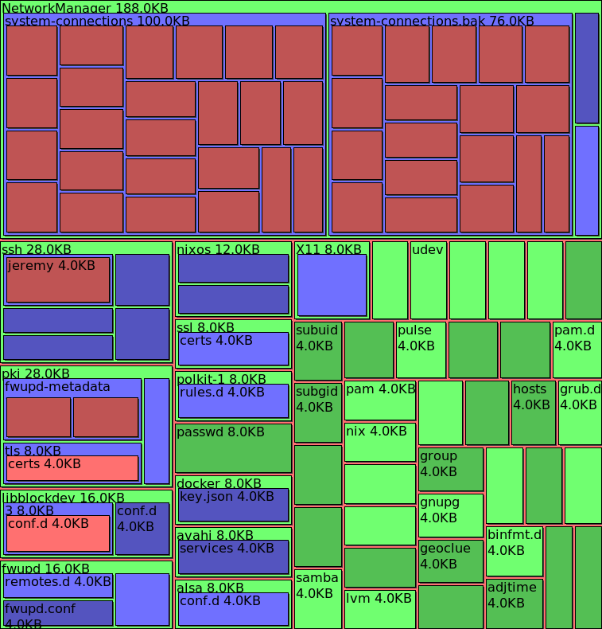

# tkdu

Visualize the output of `du`.

## Usage

    df -a / | tkdu.py -




```
Usage:
  tkdu.py <file.gz>     interpret file as gzipped du -ak output and visualize it
  tkdu.py <file>        interpret file as du -ak output and visualize it
  tkdu.py <folder>      analyze disk usage in that folder
  tkdu.py -             interpret stdin input as du -ak output and visualize it
  tkdu.py               ask for folder to analyze

Controls:
  * Press `q` to quit
  * LMB: zoom in to item
  * RMB: zoom out one level
  * Press `1`..`9`: Show that many nested levels
  * Press `0`: Show man nested levels
```

## History

This is a fork of [Daniel Beck's fork] of [Jeff Epler's original tkdu] to visualize disk usage and `du` output.

[Daniel Beck's fork]: https://github.com/daniel-beck/tkdu
[Jeff Epler's original tkdu]: https://web.archive.org/web/20090113182447/http://unpythonic.net:80/jeff/tkdu/
